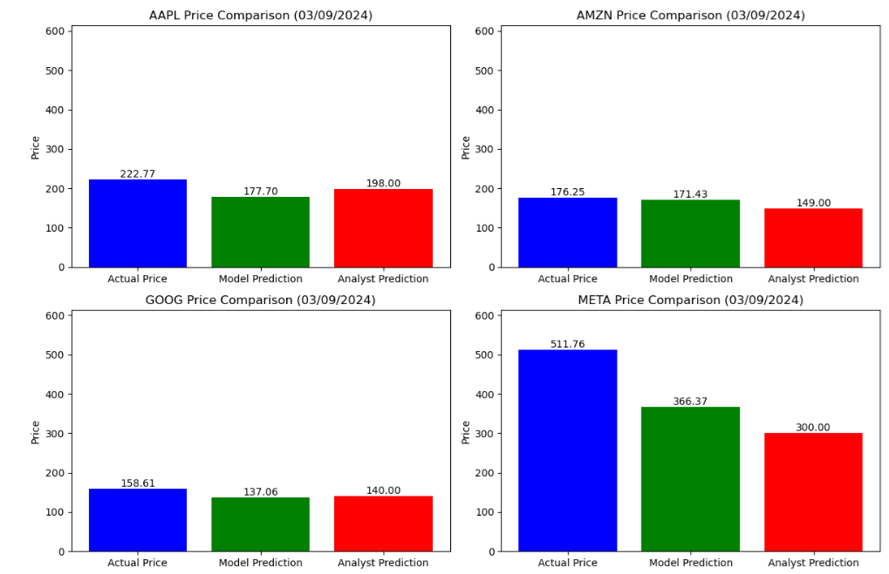

# Model Card

## Model Description
There is a sperate model for each stock symbol (AAPL, AMZN, GOOG, META).
Each model is stored with its scaler in the ./models directory and an example use can be seen in the notebook Model_Test.ipynb

**Input:** 
The model takes historical stock price data and sentiment analysis as inputs.
The features used include:
- `day_of_week`: Day of the week of the close price to predict (0 = Monday, 6 = Sunday)
- `month`: Month of the year of the close price to predict (1 = January, 12 = December)
- `year`: Year of the close price to predict
- `previous_close_price`: The closing price of the stock from the last available day (closest) to the prediction
- `average_sentiment`: Average sentiment score for the stock, based on news and social media
- `sentiment_3m_avg`: 3-month  average sentiment score
- `sentiment_1m_avg`: 1-month  average sentiment score

Example
```
# Define the symbol for which you want to load the model
symbol = 'AAPL'  # Replace with your desired stock symbol

# Load the saved XGBoost model
with open(f'./models/{symbol}_xgboost_model.pkl', 'rb') as model_file:
    loaded_model = pickle.load(model_file)

# Load the saved scaler
with open(f'./models/{symbol}_scaler.pkl', 'rb') as scaler_file:
    loaded_scaler = pickle.load(scaler_file)

# Prepare input data for prediction
# Assume we want to predict the price for 3rd September 2024
predict_date = pd.Timestamp('2024-09-03')

# You need to provide the latest available features for prediction
# For example, these could be the latest known values
last_close_price = 150.00  # Replace with actual last close price
last_sentiment = 0.05      # Replace with actual last sentiment score
last_sentiment_3m = 0.04   # Replace with actual last 3-month sentiment average
last_sentiment_1m = 0.06   # Replace with actual last 1-month sentiment average

# Create a DataFrame with the input features
predict_data = pd.DataFrame({
    'day_of_week': [predict_date.dayofweek],
    'month': [predict_date.month],
    'year': [predict_date.year],
    'previous_close_price': [last_close_price],
    'average_sentiment': [last_sentiment],
    'sentiment_3m_avg': [last_sentiment_3m],
    'sentiment_1m_avg': [last_sentiment_1m]
})

# Scale the input features using the loaded scaler
predict_data_scaled = loaded_scaler.transform(predict_data)

# Make the prediction using the loaded model
predicted_price = loaded_model.predict(predict_data_scaled)[0]

```

**Output:**  
The model outputs a single continuous value, which is the predicted closing price of the stock for a specific future date (A Target Price).

**Model Architecture:**  
The model is based on XGBoost, a gradient-boosting decision tree algorithm that is highly efficient for structured/tabular data. 
The model uses Bayesian Optimization to fine-tune hyperparameters like `n_estimators`, `learning_rate`, `max_depth`, `min_child_weight`, and others. 
These hyperparameters are optimized based on the mean squared error (MSE) on a validation dataset.

## Performance
The model’s performance is measured using the Mean Squared Error (MSE), Root Mean Squared Error, Mean Absolute Error (MAE) and (RMSE) and R<sup>2</sup>
For each stock symbol, the model is evaluated on historical data, predicting future prices.

The model is then tested using an example of a 12-month prediction actual prices and analyst target prices.

A visualization of model performance comparing actual prices, predicted prices, and analyst target prices is shown below:



## Limitations

- **Real-time performance**: The model does not work in real-time as sentiment data may not be updated frequently.
- **Sentiment accuracy**: Sentiment analysis relies on external data sources, which may not always provide accurate or complete information. This could result in biased predictions.
- **Limited by past trends**: The model is trained on historical data, meaning that it may not adapt well to unexpected market shifts (e.g., sudden economic crises or major corporate events).
- **Specific to selected stocks**: The model is trained on specific stock symbols, and its generalization to other stocks is not guaranteed.

## Trade-offs

- **Bias towards historical trends**: The model may perform well for stocks that follow consistent patterns, but could struggle in periods of high market volatility.
- **Computational cost**: Bayesian Optimization of hyperparameters provides improved performance but increases the computation time during the training phase.
- **Data dependency**: The model’s accuracy is highly dependent on the quality of both the price data and the sentiment data. Poor sentiment data may reduce the accuracy of predictions.
- **Hyperparameter tuning**: The model requires careful tuning of hyperparameters using Bayesian Optimization, which can be computationally expensive and time-consuming but results in better generalization.
 
